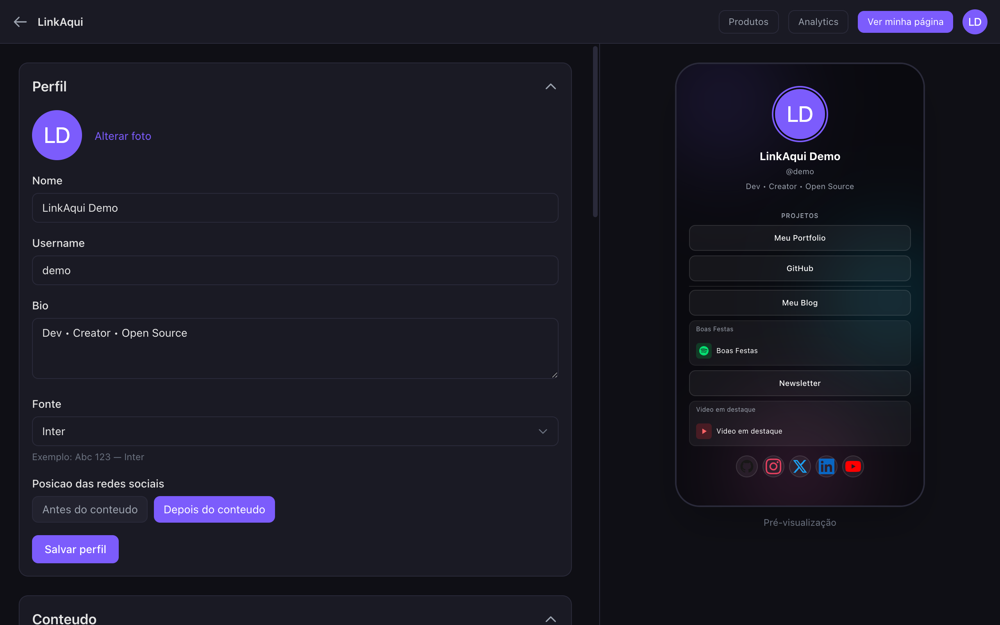
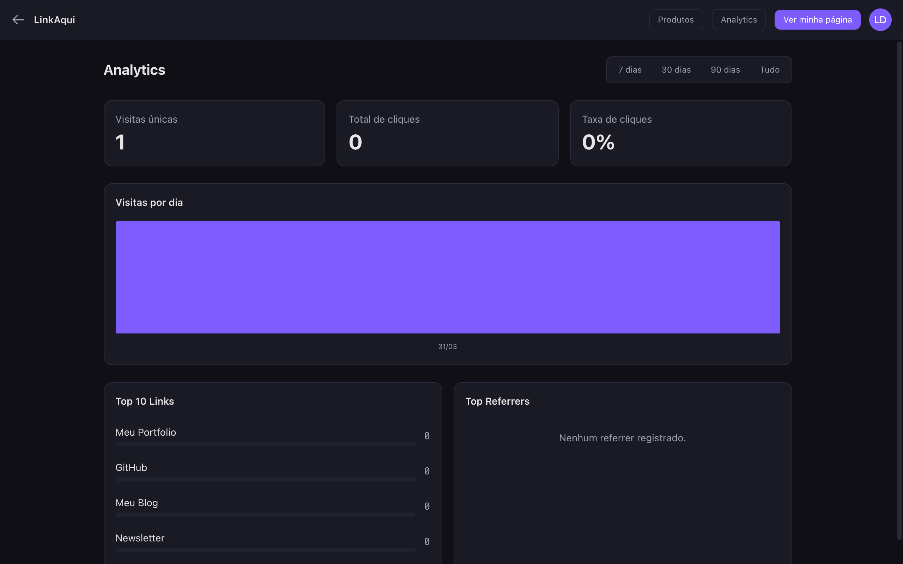
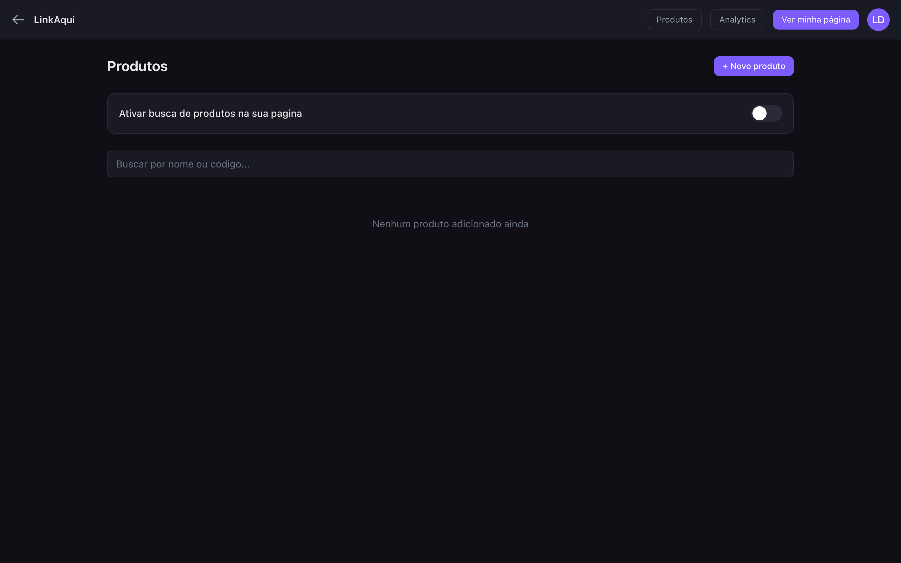
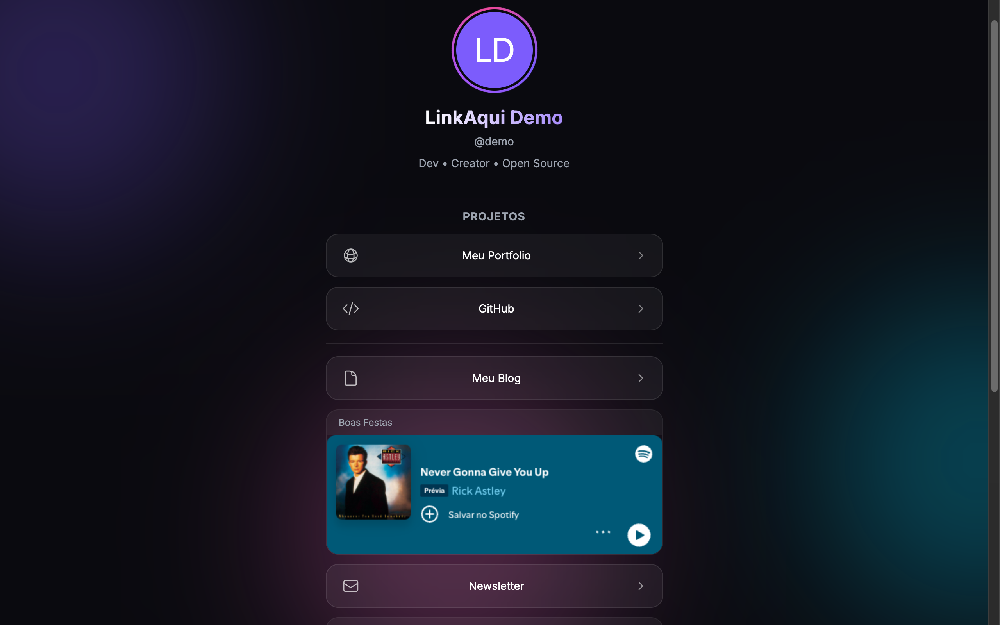

[🇧🇷 Portugues](README.md)

# LinkAqui

Your link page, your way. An open source alternative to Linktree, built with Laravel, Livewire and Tailwind CSS.

<p align="center">
  
</p>

## Screenshots

<details>
<summary>View all screens</summary>

### Landing Page


### Page Builder


### Analytics


### Products


### Public Profile (Desktop)


</details>

## Features

### For users

- **Customizable links** -- Add as many links as you want with visual icons, colors (RGBA with alpha/transparency) and custom images
- **Social links** -- Connect your social networks by entering just your username (Instagram, GitHub, Twitter, LinkedIn, TikTok, YouTube, WhatsApp, Telegram, Discord, Twitch, Spotify, Email, Website)
- **Embeds** -- Embed content from YouTube, Spotify, SoundCloud, Twitch, Vimeo, TikTok and Apple Music anywhere between your links
- **Themes** -- Choose from 5 modern themes with animated mesh gradients (Midnight Glow, Clean Light, Ocean Dark, Sunset Warm, Neon Cyber)
- **Custom fonts** -- Choose from 10 Google Fonts (Inter, Poppins, Montserrat, Playfair Display, etc.)
- **Page Builder** -- Interactive visual interface with live preview in mobile format
- **Free ordering** -- Links and embeds in a single list with drag-and-drop; social links can be placed before or after content (toggle)
- **Product Search** -- Affiliate product system with short codes, search on public page
- **Share** -- Copy page link with one click and generate downloadable QR Code
- **Toast notifications** -- Visual feedback on all actions (save, delete, toggle, theme change, etc.)
- **Image optimization** -- Auto resize and WebP conversion on upload (avatars, products, links)
- **Analytics** -- Dedicated page with daily visit charts, top links, click rate and referrers, with period filters (7, 30, 90 days or all time)
- **Public profile** -- Page on a unique subdomain with animations, gradient ring avatar, and dynamic themes

### Products (Affiliate System)

- Register products with: image, name, original price, sale price, affiliate URL and auto-generated short code
- Enable product search in the Builder via toggle
- On the public page, a search bar appears above the links
- Visitors type the product code → skeleton loading → product card with buy button
- Product analytics: search count and clicks per product
- Products cached (15 min), cache cleared on edit
- Rate limited and validated (regex, no injection)
- Top 5 products of the week with visual ranking

### For admins

- **Dashboard** -- System statistics with period filters, visit charts, top users
- **User detail** -- Individual analytics, linktree preview, complete information
- **User management** -- Search, activate/deactivate, promote to admin, edit data (full CRUD)
- **Visual theme editor** -- Full CRUD with color pickers per section, live mini preview
- **Inactive blocking** -- Deactivated users lose access to login and public page

### Security

- CSP headers on public pages (with permissions for YouTube, Spotify, SoundCloud, Twitch, Vimeo, TikTok, Apple Music, Google Fonts, Alpine.js)
- Rate limiting (60/min profile, 30/min clicks and product search)
- LGPD compliance (IPs hashed with daily salt, youtube-nocookie)
- Livewire with `#[Locked]` on IDs, scoped queries, Policies
- Blocking middleware for inactive users
- Embeds with sandbox and server-side URL reconstruction
- Product search: regex validation, caching, rate limiting

### Technical

- Multi-tenant via subdomain (`username.yourdomain.com`)
- Full authentication (login, registration, password reset, email verification, 2FA)
- Livewire Blaze for performance
- 3 separate design systems (profile, builder, landing)
- Image optimization with Intervention Image (resize + WebP)
- 183+ automated tests (Pest)

## Stack

| Technology | Version |
|---|---|
| PHP | 8.4 |
| Laravel | 13 |
| Livewire | 4 |
| Tailwind CSS | 4 |
| Flux UI | 2 (admin panel) |
| Pest | 4 (tests) |
| MySQL | 8+ |

## Requirements

- PHP >= 8.4
- Composer
- Node.js >= 20
- MySQL 8+
- Laravel Herd (recommended) or another local server

## Installation

### 1. Clone the repository

```bash
git clone https://github.com/hassekf/linkaqui.git
cd linkaqui
```

### 2. Install dependencies

```bash
composer install
npm install
```

### 3. Configure the environment

```bash
cp .env.example .env
php artisan key:generate
```

Edit `.env` with your settings:

```env
DB_DATABASE=linkaqui
DB_USERNAME=root
DB_PASSWORD=

APP_DOMAIN=linkaqui.test
SESSION_DOMAIN=.linkaqui.test
QUEUE_CONNECTION=database
```

### 4. Run migrations and seeds

```bash
php artisan migrate
php artisan db:seed --class=ThemeSeeder
```

### 5. Set up storage link

```bash
php artisan storage:link
```

### 6. Build assets

```bash
npm run build
```

### 7. Configure wildcard subdomain

For `username.linkaqui.test` to work, you need to configure wildcard DNS.

#### With Laravel Herd:

```bash
herd link linkaqui
herd secure linkaqui
```

Configure in Herd preferences so that `*.linkaqui.test` points to `127.0.0.1`.

#### With Valet:

```bash
valet link linkaqui
valet secure linkaqui
```

### 8. Start the development server

```bash
composer run dev
```

Visit: `http://linkaqui.test`

## Jobs & Queues

LinkAqui uses queued jobs to process analytics (visits and clicks) without blocking the user response.

### Available jobs

| Job | Description |
|---|---|
| `RecordVisit` | Records unique visit (IP hashed with daily salt, 24h deduplication) |
| `RecordClick` | Records link click (increments denormalized counter) |

### Running workers

**In development**, `composer run dev` already starts the queue worker automatically.

To run manually:

```bash
# Basic worker
php artisan queue:work

# Worker with automatic restart on changes
php artisan queue:listen

# Production worker (recommended with Supervisor)
php artisan queue:work --sleep=3 --tries=3 --max-time=3600
```

### Cleanup command

Analytics data older than 90 days is removed automatically:

```bash
# Run manually
php artisan analytics:prune

# In production, already scheduled to run daily via scheduler
```

For the scheduler to work in production, add to crontab:

```bash
* * * * * cd /path/to/project && php artisan schedule:run >> /dev/null 2>&1
```

## Usage

### User flow

1. Register at `linkaqui.test` (username becomes the subdomain)
2. Access the **Builder** (`/builder`) to manage your page
3. Add links, social networks, embeds and choose a theme and font
4. Register affiliate products in **Products** (`/products`) and enable search in the Builder
5. Reorder everything with drag-and-drop in the unified content list
6. See the live preview in the right panel (mobile: below content)
7. Share your page: `yourusername.linkaqui.test`
8. Track statistics in **Analytics** (`/analytics`)

### Routes

| Route | Method | Description |
|---|---|---|
| `/` | GET | Landing page (visitors) / redirect to builder (logged in) |
| `/builder` | GET | Page builder with live preview |
| `/analytics` | GET | Visit and click statistics with filters |
| `/products` | GET | Affiliate product management |
| `/settings/profile` | GET | Profile settings |
| `/settings/appearance` | GET | Appearance |
| `/settings/security` | GET | Security and 2FA |
| `/admin` | GET | Admin dashboard with charts |
| `/admin/users` | GET | User management (CRUD) |
| `/admin/users/{user}` | GET | User detail with analytics and preview |
| `/admin/themes` | GET | Visual theme editor (CRUD) |
| `{username}.domain/` | GET | Public profile page |
| `{username}.domain/click/{link}` | POST | Track link click |
| `{username}.domain/product/search` | GET | Search product by code |
| `{username}.domain/product/{code}/click` | POST | Track product click |

## Admin Panel

The admin panel is at `/admin`. To promote a user to admin:

```bash
php artisan tinker --execute 'App\Models\User::where("username", "your-username")->update(["is_admin" => true]);'
```

## Analytics

### Visits
- Recorded via queued job (`RecordVisit`)
- IP hashed with daily salt (LGPD compliance)
- Deduplication: same IP does not count as new visit within 24h
- Daily visit charts with period filters

### Clicks
- Recorded via queued job (`RecordClick`)
- Denormalized counters for performance
- Click rate per link

### Referrers
- Traffic source tracked and displayed in analytics

### Auto cleanup
- Data older than 90 days is removed daily by the `analytics:prune` command

### Admin
- Dashboard with global statistics and charts
- Per-user detail page with individual analytics and linktree preview

## Development

```bash
# Run all tests
php artisan test

# Run a specific test
php artisan test --filter=ProfilePageTest

# Format code
vendor/bin/pint

# Clear view cache
php artisan view:clear

# Development server (includes queue worker, vite, and pail)
composer run dev
```

## Project Structure

```
app/
  Concerns/             Traits (BelongsToUser, ProfileValidationRules)
  Console/Commands/     Commands (PruneAnalyticsCommand)
  Enums/                Enums (LinkType, EmbedType, SocialPlatform)
  Http/Controllers/     Controllers (ProfilePageController, TrackClickController,
                          ProductSearchController, TrackProductClickController)
  Http/Middleware/       Middlewares (EnsureUserIsAdmin, EnsureUserIsActive, CSP)
  Jobs/                 Analytics jobs (RecordVisit, RecordClick)
  Livewire/Admin/       Admin components (Dashboard, UserManager, UserDetail, ThemeManager)
  Livewire/Builder/     Builder components (ContentList, ProfileSettings, LivePreview,
                          Analytics, Products, etc.)
  Models/               Models (User, Link, SocialLink, Embed, Theme, Visit, Click, Product)
  Policies/             Policies (LinkPolicy, SocialLinkPolicy, EmbedPolicy)
  Services/             Services (EmbedService, AnalyticsService)
resources/
  css/app.css           Flux UI + admin (Tailwind)
  css/profile.css       Public profile design system
  css/builder.css       Page builder design system
  css/landing.css       Landing page design system
  views/components/     Blade components (builder/*, social-icon, link-icon)
  views/layouts/        Layouts (admin, builder, landing, app, auth)
  views/livewire/       Livewire component views
  views/profile/        Public profile page
routes/
  web.php               Main routes (landing, builder, analytics, products, admin)
  profile.php           Public profile routes (subdomain, product search/click)
  settings.php          User settings routes
  console.php           Command scheduling (prune analytics)
tests/
  Feature/Admin/        Admin tests (Dashboard, UserManager, UserDetail, ThemeManager)
  Feature/Auth/         Authentication and middleware tests
  Feature/Builder/      Builder tests (ContentList, Links, Embeds, Social, Profile, Theme)
  Feature/Profile/      Public profile and click tracking tests
  Feature/              Product, analytics, landing page tests, etc.
  Unit/                 Unit tests (EmbedService, AnalyticsService)
  Arch/                 Architecture tests
```

## License

MIT

## Contributing

Contributions are welcome! Open an issue or submit a pull request.
